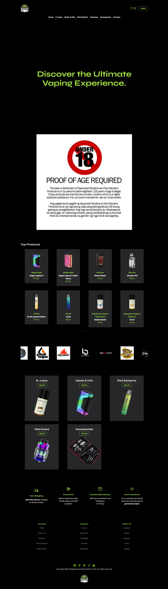
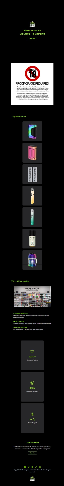
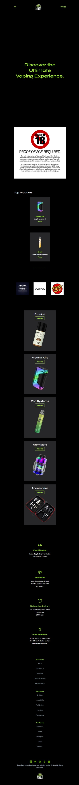

<h2>About the project ❓</h2>

  
A <b>Vape Shop</b> website is an online platform that allows users to buy a electronic device ( Vape ) used for inhaling vapor containing nicotine and flavoring ( E-juice ). The website provides with easy-to-use navigation and a simple shopping experience that puts the focus on the products.

👉 Live Demo: <a href='https://covape-19-garage-rthrx44.vercel.app/'>Live Demo</a>

<h3>Build with</h3> 

<h2>Screenshots of the Project 📸</h2>
 

<h3 align='center'>Landing Page Large Screen 💻</h3>

<h3 align='center'>Dashboard Page Large Screen 💻</h3>

<h3> Landing Page Small Screen 📱</h3>

<h3> Dashboard Page Small Screen 📱</h3>

